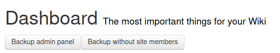

## Admin Panel Backup User Script

This userscript is intended for Wikidot site administrators to back up data related to a site's settings, ban data, and membership.

Backing up takes around a minute for small sites (those under a few hundred members), and requires more time depending on how many site members, categories, layouts, and Wikidot themes the site has. For instance, backing up SCP-EN takes about an hour.

The output is a ZIP file filled with (primarily) JSON files:

* `site.json` &mdash; Contains general site information and miscellaneous or top-level settings.
* `categories.json` &mdash; Contains information about page categories (e.g. `component:`, `theme:`) and associated settings, like access permissions.
* `themes.json` &mdash; Contains site theme data. This is _not_ the same as page themes, which uses `[[include]]` to add styling to a page, but the Wikidot-level concept configurable only in the admin panel.
* `layouts.json` &mdash; On the same page as the above, this lists site layout data. This Wikidot concept permits changing the HTML structure of a site.
* `bans.json` &mdash; Contains a list of user bans (i.e. bans by user ID) and IP bans (i.e. IPv4 addresses), along with timestamps and ban reasons.
* `members.json` &mdash; Contains a list of site members along with their join date, and a list of the moderators and admins on a site.
* `forum.json` &mdash; Contains information about the structure and settings of the site's forum. **If the site forums are disabled, this file will be absent.**
* `favicon.*`, `iosicon.*`, `wp8icon.*` &mdash; Site favicons. The extension will vary depending on the image type. **If an icon is not included / its default value, its respective file will be absent.**

You can [install the script](https://github.com/scpwiki/admin-backup-script/raw/main/admin-backup.user.js) here. If you encounter errors backing up on your site, please open the browser console and report whatever errors appeared.

Available under the MIT License.
