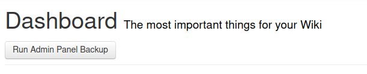

## Admin Panel Backup User Script

**Currently in testing**

This userscript is intended for Wikidot site administrators to back up data related to a site's settings, ban data, and membership. Backing up takes a few minutes for small sites (those under a few hundred members), and takes longer the more site members, categories, layouts, and Wikidot themes the site has. The output is a ZIP file filled with primarily JSON files.

You can [install the script](https://github.com/scpwiki/admin-backup-script/raw/main/admin-backup.user.js) here. If you encounter errors backing up on your site, please open the browser console and report whatever errors appeared.

Available under the MIT License.
